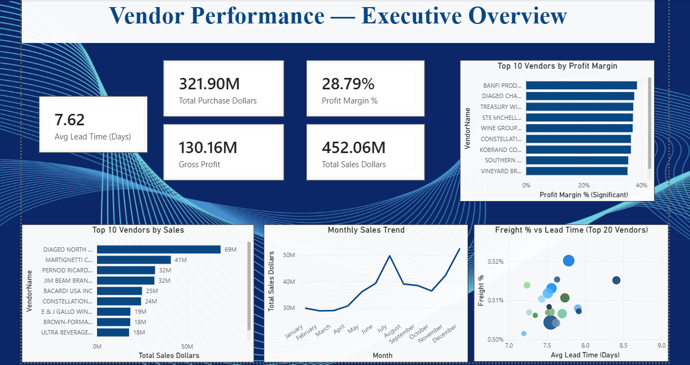
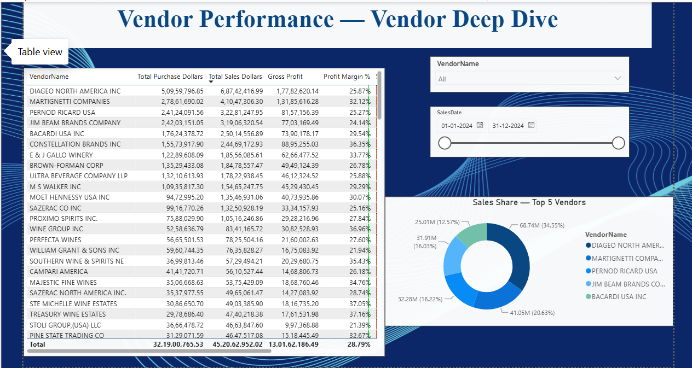

# Vendor Performance Analysis

End-to-end vendor performance analysis using MySQL, Python, and Power BI — analyzing 12.8M+ sales records to uncover vendor profitability, freight efficiency, and delivery performance for a liquor retail business.

## Tech Stack

- **MySQL** — data warehousing, schema design, EDA via SQL
- **Python** (pandas, SQLAlchemy, matplotlib, seaborn) — data extraction, analysis, visualization
- **Power BI** — interactive dashboard (star schema, DAX measures)
- **Excel/CSV** — raw data source

## Project Structure

```
├── data/
│   ├── sample/                # sample rows for reference (full raw data not tracked)
│   └── processed/             # cleaned outputs (vendor_summary.csv)
├── sql/
│   ├── schema.sql              # table definitions
│   └── eda_queries.sql         # SQL EDA queries
├── python/
│   ├── db_connection.py        # reusable MySQL connection helper
│   ├── inspect_data.py         # initial data inspection
│   ├── load_to_mysql.py        # bulk data ingestion (LOAD DATA LOCAL INFILE)
│   ├── eda_analysis.py         # Python EDA, derived metrics, charts
│   └── make_samples.py         # generates sample CSVs for the repo
├── powerbi/
│   └── vendor_performance_dashboard.pbix
├── docs/
│   ├── vendor_performance_report.md
│   └── charts/                 # exported charts and dashboard screenshots
├── requirements.txt
├── .env.example
└── .gitignore
```

## Data Pipeline

1. **Raw CSVs** (`begin_inventory`, `end_inventory`, `purchases`, `purchase_prices`, `sales`, `vendor_invoice`) loaded into MySQL via `LOAD DATA LOCAL INFILE` — chosen over row-by-row inserts since `sales.csv` alone contains 12.8M rows.
2. **SQL EDA** — vendor purchase/sales performance, freight %, lead time, and data quality checks (orphan records, whitespace inconsistencies).
3. **Python analysis** — pulled aggregations via SQLAlchemy, computed derived metrics (profit margin %, sell-through %), generated charts with matplotlib/seaborn.
4. **Power BI** — star schema (`Vendor` and `Brand_Dim` dimension tables + 5 fact tables), custom DAX measures, 2-page interactive dashboard.

## Key Findings

Full analysis in [`docs/vendor_performance_report.md`](docs/vendor_performance_report.md). Highlights:

- **Diageo North America** is the top vendor by revenue (~$68.7M in sales), but isn't the most profitable.
- **Constellation Brands** and **E&J Gallo Winery** lead on profit margin (~36% and ~34%) among high-volume vendors — margin doesn't always track with volume.
- **Freight cost** is remarkably consistent at ~0.5% of invoice value across almost all vendors — no vendor is disproportionately burdening the business with shipping costs.
- **Delivery lead times** range 7-13 days across vendors, with no extreme outliers.

## Data Quality Notes

- Vendor names contained inconsistent trailing whitespace, which caused duplicate groupings during aggregation — resolved using SQL `TRIM()` and Power Query `Table.Group`.
- A small number of `Brand`/`VendorNumber` values exist in `purchases`/`sales` without a matching record in `purchase_prices`/`vendor_invoice` — expected in real-world vendor data, tracked via orphan-record checks rather than enforced foreign keys.
- The `Approval` column in `vendor_invoice` is ~44% zero and ~56% null — retained as-is rather than dropped, since both likely represent distinct business states rather than missing data.

## Known Limitations / Future Improvements

- Purchase dates and sales dates aren't cross-filterable through a single Power BI slicer, since there's no shared date dimension yet — adding a calendar table with `USERELATIONSHIP` in DAX would resolve this.
- Full raw datasets aren't included in this repo due to size; representative sample rows are provided in `data/sample/`.

## Dashboard Preview




## Setup

1. Run `sql/schema.sql` in MySQL to create the database and tables.
2. Copy `.env.example` to `.env` and fill in your MySQL credentials.
3. Run `python python/load_to_mysql.py` to load data (point it at your own raw CSVs).
4. Run `python python/eda_analysis.py` to generate the vendor summary table and charts.
5. Open `powerbi/vendor_performance_dashboard.pbix` in Power BI Desktop and refresh the data source.

## Project Reports
- [Project Problem Statement](docs/Vendor_Performance_Analysis_Report.docx)
- [Executive Business Insights Report](docs/Vendor_Performance_Executive_Insights_Report.docx)
